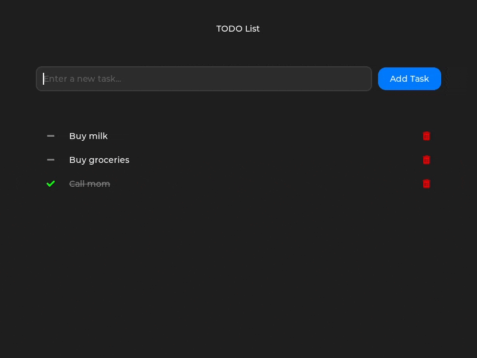

# lvgl_raylib

## Project Overview

`lvgl_raylib` is lightweight binding library designed to simplify desktop application development with minimal computational overhead. This project delivers efficient and responsive graphical interfaces through a strategic combination of two powerful libraries `LVGL` and `Raylib`.

## The reasons for the project's existence

Modern software development is drowning in bloat. Electron apps turn a simple todo list into a 200MB monster—pure computational gluttony. Our project? A lean, mean 1MB alternative that laughs in the face of unnecessary complexity.

Raylib rocks a killer API, but was missing a robust UI toolkit. Raygui? Abandoned. We saw a gap and punched through it with a solution that doesn't compromise.

We stress-tested existing LVGL bindings of GLFW/OpenGLES/X11 and found them pathetic: a "simple" example consuming 100% CPU while doing jack squat. Our LVGL+Raylib combo? A performance beast, idling at a mere 5-6% CPU utilization. That's not just optimization—that's engineering poetry.

Qt's great, but it's becoming a Swiss Army knife when we need a precision scalpel. Each version adds more complexity, more overhead. We're building something different: focused, efficient, ruthlessly pragmatic.

Bottom line: We're not just building a library. We're declaring war on software bloat, crafting a development approach that's lightning-fast, razor-sharp, and unapologetically lean.

## Core Architecture

The library leverages the strengths of:
- **LVGL**: Provides a comprehensive widget system and UI management
- **Raylib**: Offers hardware-accelerated rendering and streamlined input event processing

## Project Scope

### Objectives
- Deliver an accessible framework for desktop GUI development
- Create a performant alternative to Electron-based applications
- Emphasize ease of use and minimal complexity

### Limitations
- Not designed for embedded system development
- Does not support extensive configuration scenarios

## Getting Started

### Prerequisites

#### System Dependencies
For Ubuntu/Debian-based systems, install the following build dependencies:

```sh
sudo apt install cmake build-essential libegl1-mesa-dev
```

### Build And Run The Example

1. Clone the repository:
```sh
git clone --recursive https://github.com/thaolt/lvgl_raylib.git
```

2. Build the example project:
```sh
cd lvgl_raylib
mkdir -p build && cd build
cmake .. && make -j
./lvgl_raylib_example/lvgl_raylib_example
```

### Quick Application Bootstrapping

Create a new project by copying and modifying the example:

```sh
git clone --recursive https://github.com/thaolt/lvgl_raylib.git myapp
cd myapp
rm -r .git
mv lvgl_raylib_example myapp
```

Update the root `CMakeLists.txt`:
```diff
-add_subdirectory(lvgl_raylib_example)
+add_subdirectory(myapp)
```

Build and run:
```sh
mkdir -p build && cd build
cmake ..
make -j
./myapp/myapp
```

## Code Example

Here's a concise demonstration of creating a simple UI:

```c
#include "raylib.h"
#include "lvgl.h"
#include "lvgl_raylib.h"

#define WIDTH 800
#define HEIGHT 600

void create_widgets() {
    // Create a text input for name
    lv_obj_t *name_ta = lv_textarea_create(lv_screen_active());
    lv_textarea_set_placeholder_text(name_ta, "Enter your name");
    lv_obj_set_width(name_ta, 250);
    lv_obj_align(name_ta, LV_ALIGN_CENTER, 0, -50);

    // Create an interactive button
    lv_obj_t *btn = lv_button_create(lv_screen_active());
    lv_obj_set_width(btn, 250);
    lv_obj_set_height(btn, 50);
    lv_obj_align(btn, LV_ALIGN_CENTER, 0, 50);
    lv_obj_add_flag(btn, LV_OBJ_FLAG_CLICKABLE);

    // Add label to button
    lv_obj_t *btn_label = lv_label_create(btn);
    lv_label_set_text(btn_label, "Click me");
    lv_obj_center(btn_label);
}

int main() {
    InitWindow(WIDTH, HEIGHT, "LVGL Raylib Example");
    SetTargetFPS(60);
    lvgl_raylib_init(WIDTH, HEIGHT);
    create_widgets();

    while (!WindowShouldClose()) {
        lvgl_raylib_process_events();
        BeginDrawing();
        ClearBackground(DARKGRAY);
        lvgl_raylib_render();
        EndDrawing();
    }

    lvgl_raylib_deinit();
    CloseWindow();
    return 0;
}
```

## TODO App

Of course, no modern GUI library demo would be complete without a classic TODO application.




## Contributing

We welcome and appreciate community contributions! Please follow these guidelines:

### Contribution Process
1. **Repository Setup**
   - Fork the project
   - Clone your forked repository
   - Create a descriptive branch (e.g., `feature/add-new-widget`)

2. **Development Best Practices**
   - Adhere to existing code style and conventions
   - Add or update tests for new functionality
   - Ensure all tests pass before submitting

3. **Pull Request Guidelines**
   - Provide a clear, descriptive title and description
   - Reference related issues
   - Be open to constructive feedback

### Code of Conduct
- Maintain a respectful and inclusive environment
- Offer constructive and supportive feedback
- Collaborate with empathy and professionalism

## License

This project is released under the MIT License. See the LICENSE file for complete details.

Copyright (c) 2025 thaolt
